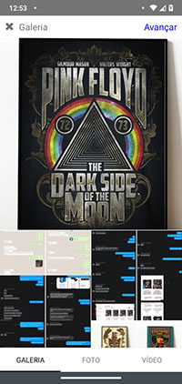
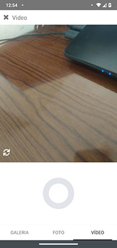

A mobile version of publish page based on Instagram. It was builded using [React Native version 0.59.4](https://reactnative.dev/docs/0.59/getting-started).

## How can I run it?

Clone the project.
In the project directory, you can run:

### `npm install`

or

### `yarn install`

and than run:

### `react-native run-android`

or

### `react-native run-ios`

Than you will get this:

